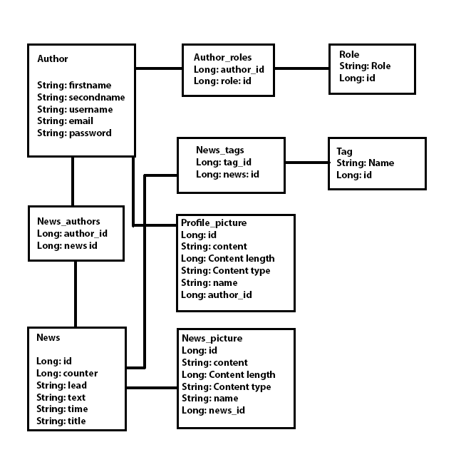

## Dokumentti

#### Kuvaus

Uuster on yksinkertainen [cms](https://en.wikipedia.org/wiki/Content_management_system) ensisijaisesti uutisille. 

#### Käyttötapaukset

- Käyttäjä voi tehdä itselleen käyttäjän
- Käyttäjä voi muokata omia tietojansa ja lisätä profiilikuvan
- Käyttäjä voi lisätä uutisia tageilla ja kuvilla
- Käyttäjä voi listata uutisia tageilla
- Käyttäjä voi poistaa ja muokata uutisia

#### Tietokanta skeema



#### Käyttöohje

Voit käyttää sovellusta suoraan [herokussa](uuster.herokuapp.com)

#### Asennusohje

```
Gradle build
Gradle run
```

#### Puuttuvat ominaisuudet ja muut puutteet

- Testikattavuus on matala
- Validaatiota voisi vielä parantaa ja varsinkin käyttäjän oman profiilin muokkaamista voisi parantaa ja validoida tarkemmin.